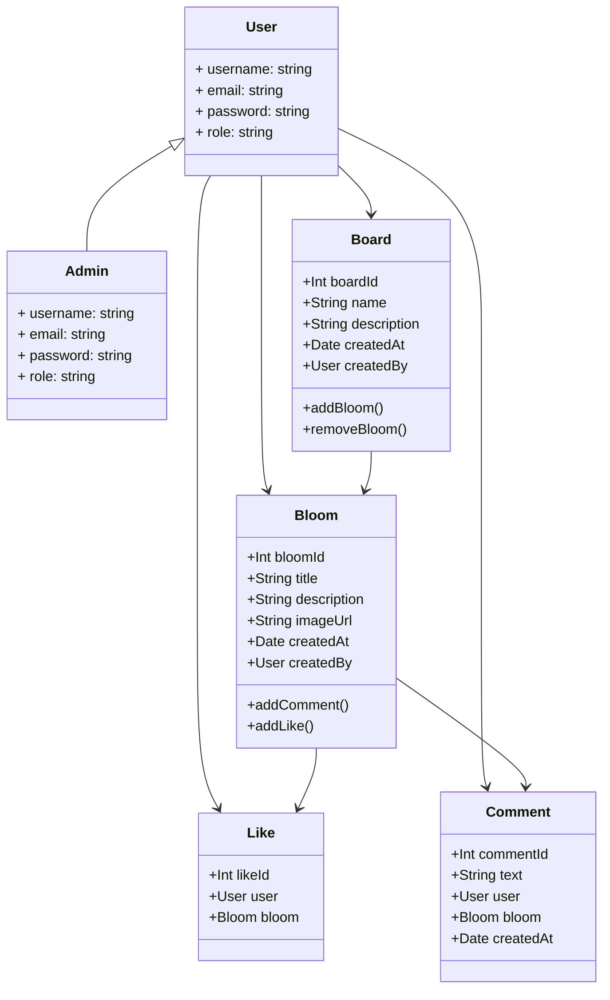

# Table of Contents

1. [BoardBloom](#boardbloom)
2. [System Requirements](#system-requirements)
2. [Demo](#demo)
2. [Stories](#stories)
2. [App Design](#app-design)
2. [UML Diagram](#uml-diagram)
3. [Architecture Overview](#architecture-overview)
4. [Data Model](#data-model)
   <!-- - [User](#user)
   - [Bloom](#bloom)
   - [Board](#board)
   - [Comment](#comment)
   - [Like](#like) -->
5. [Controllers](#controllers)
   <!-- - [UserController](#usercontroller)
   - [BloomController](#bloomcontroller)
   - [BoardController](#boardcontroller)
   - [CommentController](#commentcontroller) -->
6. [Views](#views)
8. [Data Access Layer](#data-access-layer)
9. [Security](#security)
10. [Deployment](#deployment)
11. [Testing](#unit-testing)
11. [AI use](#ai-used-to-help-with-development)


# BoardBloom

With BoardBloom, users can create, share, and find "Blooms," or visual material on the web. Users get the option to save Blooms they like on their boards. Boards work as topical collections that let users group their Blooms corresponding to projects or interests. A user may create distinct boards, for instance, for dinner ideas, cars or haircuts. The main forms of engagement on the platform are creating boards and Blooms, while liking and commenting are supported as well.

# Demo

## Link demo YouTube: [here](https://www.youtube.com/watch?v=-lX3BnoPyTg).

# System Requirements

- .NET 6.0 SDK
- Visual Studio 2022 or later
- SQL Server or any compatible database system
- A web browser (latest versions of Chrome, Firefox, or Edge)

# Stories

1. *As an administrator, I want to create, view, edit, and delete categories directly from the application interface, enabling flexible content organization.*

2. *As a visitor (registered or not), I want to view all bookmarks added to the platform, allowing me to explore content without restrictions.*

3. *As a user, I want to see the most recent and popular posts on the main page for better navigation.*

4. *As a registered user, I need to add posts with title, description, and embedded media (text, images, and videos) to the platform, expanding the content available to the community.*
   
5. *As a registered user, I want to comment on for posts, edit and delete my comments, fostering an interactive and engaged community.*

6. *As a registered user I want to have the ability to like a post, and also to remove my like*

7. *As a registered user, I need to organize posts into bookmarks on my personal page, allowing me to personalize my experience and find content easily.*

8. *As an administrator, I am responsible for content moderation, including the ability to delete inappropriate bookmarks or comments, ensuring the platform remains a safe and welcoming space.*

9. *As an administrator, I want to ban users from the application interface, mainting organizing groups.*

10. *As a developer, I need to design a database schema that supports users, roles, posts, bookmarks, comments, categories, and search functionality, ensuring scalability and performance.*

# Backlog
The development of the app was monitored using Trello.The following screenshot shows the Trello board used to track the progress of the project during development.


# App Design

- Home Page Design
  - Multiple cards (with photo, user, description, like count and date of posting).


- View Bloom Design 
  - Card (with photo, user, description, like count and date of posting)
  - Comment list
  - Form for adding comments
  - One button for accessing user profile(the username)


  
- Other options for blooms
  - Form for editing comments  

    

  - Form for adding bloom to board

    

- Create Bloom Design
  - Two buttons(for choosing the type of post)
  - Two text fields(one for description and one for image url/text(for text post)) 
  - One button for preview


- Edit Bloom Design
  - One field for description 
  - One field for image url/text(for text post)


- Preview Bloom
  - One card showing the bloom
  - Button for returning to editing 
  - Button for applying the changes/posting  


- Create Board Design 
  - Two fields(one for Name and one for Description)
  - One button to create the board
  


- Boards Design
  - Cards showing the preview of boards(clickable-redirects to view board)
  - Button for adding a new board


- View Board Design
  - Image preview of the saved blooms (clickable-redirects to view bloom)
  - Two buttons for editing and deleting(shown by hovering on the 3 dots)
  - Remove button for deleting a bloom from the board (shown by hovering on the bloom image)


- Edit Board Design
  - Two fields(one for Name and one for Description)
  - One button to save the board


- Profile Page Design
  - Section for user specifics(profile image, email, number of blooms and boards)
  - Cards showing user's boards
  - Cards showing user's blooms


- Register Form Page Design
  - Three fields (one for email, one for password and one for confirming the password)
  - One button for confirming registration


- Login Form Page Design
  - Two field (one for email and one for password)
  - A checkbox for remembering the account
  - A button for logging in


# UML Diagram



# Architecture Overview
BoardBloom is built using the MVC pattern to separate concerns:

- Model: Represents the data and business logic.
- View: Represents the presentation layer.
- Controller: Handles user input and interactions.

# Data Models

## User
Represents the users of the application.

#### Properties:

- UserId (int): Unique identifier for the user.
- Username (string): User's username.
- Email (string): User's email address.
- PasswordHash (string): Hash of the user's password.
- Role: Role of the user (Admin or User).

## Bloom
Represents individual posts created by users.

### Properties:

- BloomId (int): Unique identifier for the bloom.
- Title (string): Title of the bloom.
- Content (string): Description of the bloom.
- ImageUrl (string): URL of the image associated with the bloom.
- TotalLikes (int): A counter holding the number of likes of the bloom.
- UserId (int): Foreign key referencing the user who created the bloom.
- Date (DateTime): Date and time when the bloom was created.

## Board
Represents collections of Blooms.

### Properties:

- BoardId (int): Unique identifier for the board.
- Name (string): Title of the board.
- Note (string): Description of the board.
- UserId (int): Foreign key referencing the user who created the board.

## BloomBoard
Represent the associative relationship between blooms and boards.

### Properties:

- BloomBoardId (int): Unique identifier for the bloomboard.
- BoardId (int): Unique identifier for the board.
- BloomId (int): Unique identifier for the bloom.
- Date (DateTime): Date and time when the relationship was created.

## Comment
Represents comments on Blooms.

### Properties:

- CommentId (int): Unique identifier for the comment.
- Content (string): Content of the comment.
- UserId (int): Foreign key referencing the user who created the comment.
- BloomId (int): Foreign key referencing the bloom the comment is associated with.
- Date (DateTime): Date and time when the comment was created.

## Like
Represents likes on Blooms.

### Properties:

- LikeId (int): Unique identifier for the like.
- UserId (int): Foreign key referencing the user who liked the bloom.
- BloomId (int): Foreign key referencing the bloom that was liked.

# Controllers


## UserController
Handles user-related operations.

### Actions:

- Register(): Register a new user.
- Login(): Authenticate a user.
- Logout(): Log out the current user.
- UserProfile(int id): View a user's profile. 

## BloomController
Handles bloom-related operations.

### Actions:

- Index(): View all blooms.
- Show(int id): View details of a specific bloom.
- New(): Create a new bloom.
- Previwe(Bloom bloom): Allows the user to see how a bloom would look like before posting it.
- Edit(int id): Edit an existing bloom.
- Delete(int id): Delete a bloom.

## BoardController
Handles board-related operations.

### Actions:

- Index(): View all boards.
- Show(int id): View details of a specific board.
- New(): Create a new board.
- Edit(int id): Edit an existing board.
- Delete(int id): Delete a board.

## CommentController
Handles comment-related operations.

### Actions:

- New(int bloomId): Create a new comment on a bloom.
- Delete(int id): Delete a comment.

# Views
Views in BoardBloom are responsible for rendering the user interface. Each controller action has a corresponding view that presents the data and allows user interaction. The views are implemented using Razor syntax.

# Data Access Layer
The Data Access Layer (DAL) handles communication with the database. Entity Framework Core is used for Object-Relational Mapping (ORM), allowing for simple CRUD operations on the database.

### Example Context: ApplicationDbContext
```c#
namespace BoardBloom.Data
{
    public class ApplicationDbContext : IdentityDbContext<ApplicationUser>
    {
        public ApplicationDbContext(DbContextOptions<ApplicationDbContext> options)
            : base(options)
        {
        }
        public DbSet<ApplicationUser> ApplicationUsers { get; set; }
        public DbSet<Board> Boards { get; set; }
        public DbSet<BloomBoard> BloomBoards{ get; set; }
        public DbSet<Bloom> Blooms { get; set; }
        public DbSet<Comment> Comments { get; set; }
        public DbSet<Like> Likes { get; set; }

        protected override void OnModelCreating(ModelBuilder modelBuilder)
{
    base.OnModelCreating(modelBuilder);

    modelBuilder.Entity<BloomBoard>()
        .HasKey(bb => bb.Id);  

            modelBuilder.Entity<BloomBoard>()
             .HasOne(bb => bb.Bloom)
             .WithMany(b => b.BloomBoards)
             .HasForeignKey(bb => bb.BloomId);

            modelBuilder.Entity<BloomBoard>()
                .HasOne(bb => bb.Board)
                .WithMany(b => b.BloomBoards)
                .HasForeignKey(bb => bb.BoardId);
        }
    }
}
```
# Security
BoardBloom implements security measures to protect user data and ensure safe interactions:

- Authentication: Users must log in to access certain features.
- Authorization: Role-based access control to restrict actions to Admin or User roles.
- Data Protection: Sensitive data, such as passwords, is hashed and stored securely.

# Deployment
To deploy BoardBloom:

- Build the project in Visual Studio.
- Configure the database connection string in the appsettings.json file.
- Run database migrations to set up the database schema.
- Launch the application and verify all features are working correctly.


# AI used to help with development

- Example of ChatGPT-4 used to help with editing the layout of the app : https://chatgpt.com/share/bd5575a0-e540-4ae9-9089-208313fe3f0e
- We also used Github Copilot for in editor code suggestions and  completions and here are 2 examples: 


- ChaptGPT-4o for creating the UML Diagram for documentation: https://chatgpt.com/share/f4804ad3-87cd-4412-8f40-2be17e36e33e
  
# Unit Testing

Testing is crucial to ensure the reliability and performance of BoardBloom. Implement unit tests and integration tests to cover the following areas:

- Models: Validate data integrity and business logic.
- Controllers: Test all controller actions for expected behavior.
- Views: Ensure views render correctly with the right data.
- Security: Verify authentication and authorization mechanisms.
- Example Unit Test: BloomControllerTests

1. Index Action
Description

Tests if the Index action returns a ViewResult with the expected list of Bloom entities filtered by a search term.
Code Snippet

```c#
[Fact]
public void Index_ReturnsViewResult_WithExpectedData()
{
    // Arrange
    var fakeBlooms = new List<Bloom>
    {
        new Bloom { Id = 1, Title = "Bloom 1", Content = "Content 1", TotalLikes = 10, UserId = "user1" },
        new Bloom { Id = 2, Title = "Bloom 2", Content = "Content 2", TotalLikes = 20, UserId = "user2" }
    }.AsQueryable();

    var fakeLikes = new List<Like>
    {
        new Like { Id = 1, BloomId = 1, UserId = "user1" },
        new Like { Id = 2, BloomId = 2, UserId = "user1" }
    }.AsQueryable();

    var mockBloomDbSet = CreateMockDbSet(fakeBlooms);
    var mockLikeDbSet = CreateMockDbSet(fakeLikes);

    _mockContext.Setup(c => c.Blooms).Returns(mockBloomDbSet.Object);
    _mockContext.Setup(c => c.Likes).Returns(mockLikeDbSet.Object);

    var queryCollection = new QueryCollection(new Dictionary<string, Microsoft.Extensions.Primitives.StringValues>
    {
        { "search", "Bloom" },
        { "page", "1" }
    });

    var mockHttpContext = new Mock<HttpContext>();
    mockHttpContext.Setup(c => c.Request.Query).Returns(queryCollection);
    _controller.ControllerContext = new ControllerContext
    {
        HttpContext = mockHttpContext.Object
    };

    _mockUserManager.Setup(um => um.GetUserId(It.IsAny<ClaimsPrincipal>())).Returns("user1");

    // Act
    var result = _controller.Index() as ViewResult;

    // Assert
    Assert.NotNull(result);
    Assert.IsType<ViewResult>(result);

    var viewDataBloomsEnumerable = result?.ViewData["blooms"] as IEnumerable<Bloom>;
    var viewDataBlooms = viewDataBloomsEnumerable?.AsQueryable();
    Assert.NotNull(viewDataBlooms);
    Assert.Equal(fakeBlooms.Count(), viewDataBlooms?.Count());
}
```

2. Show Action
Description

Tests if the Show action returns a ViewResult containing the correct Bloom for the provided ID.

```c#

[Fact]
public void Show_ReturnsViewResult_WithBloom()
{
    // Arrange
    var fakeLikes = new List<Like>
    {
        new Like { Id = 1, BloomId = 1, UserId = "user1" }
    }.AsQueryable();
    
    var bloom = new Bloom
    {
        Id = 1,
        Title = "Bloom 1",
        Content = "Content 1",
        UserId = "user1",
        Likes = fakeLikes.ToList()
    };

    var mockBloomDbSet = CreateMockDbSet(new List<Bloom> { bloom }.AsQueryable());

    _mockContext.Setup(c => c.Blooms).Returns(mockBloomDbSet.Object);

    var mockLikesDbSet = CreateMockDbSet(fakeLikes.AsQueryable());
    _mockContext.Setup(c => c.Likes).Returns(mockLikesDbSet.Object);

    var user = new ClaimsPrincipal(new ClaimsIdentity(new Claim[]
    {
        new Claim(ClaimTypes.NameIdentifier, "user1")
    }, "mock"));

    _mockUserManager.Setup(um => um.GetUserId(user)).Returns("user1");

    _controller.ControllerContext = new ControllerContext
    {
        HttpContext = new DefaultHttpContext { User = user }
    };

    // Act
    var result = _controller.Show(1) as ViewResult;

    // Assert
    var viewResult = Assert.IsType<ViewResult>(result);
    var model = Assert.IsType<Bloom>(viewResult.Model);
    Assert.Equal("Bloom 1", model.Title);
}
```
3. New Action
Description

Tests if the New action returns a ViewResult with an empty Bloom model.
Code Snippet

```c#


[Fact]
public void New_ReturnsViewResult_WithEmptyBloom()
{
    // Act
    var result = _controller.New() as ViewResult;

    // Assert
    var viewResult = Assert.IsType<ViewResult>(result);
    var model = Assert.IsType<Bloom>(viewResult.Model);
    Assert.Null(model.Title);
    Assert.Null(model.Content);
}
```

4. Edit Action (Authorized User)
Description

Tests if the Edit action returns a ViewResult with the correct Bloom when accessed by an authorized user.
Code Snippet

```c#

[Fact]
public void Edit_ReturnsViewResult_WithBloomForAuthorizedUser()
{
    // Arrange
    var bloom = new Bloom { Id = 1, Title = "Bloom 1", Content = "Content 1", UserId = "user1" };
    _mockContext.Setup(db => db.Blooms.Find(1)).Returns(bloom);

    var user = new ClaimsPrincipal(new ClaimsIdentity(new Claim[]
    {
        new Claim(ClaimTypes.NameIdentifier, "user1")
    }, "mock"));

    _mockUserManager.Setup(um => um.GetUserId(user)).Returns("user1");

    _controller.ControllerContext = new ControllerContext
    {
        HttpContext = new DefaultHttpContext { User = user }
    };

    // Act
    var result = _controller.Edit(1) as ViewResult;

    // Assert
    var viewResult = Assert.IsType<ViewResult>(result);
    var model = Assert.IsType<Bloom>(viewResult.Model);
    Assert.Equal("Bloom 1", model.Title);
}
```

5. Edit Action (Unauthorized User)
Description

Tests if the Edit action returns a redirect to the home page when accessed by an unauthorized user.
Code Snippet
```c#

[Fact]
public void Edit_ReturnsRedirectToHomeForUnauthorizedUser()
{
    // Arrange
    var bloom = new Bloom { Id = 1, Title = "Bloom 1", Content = "Content 1", UserId = "user2" };
    _mockContext.Setup(db => db.Blooms.Find(1)).Returns(bloom);

    var user = new ClaimsPrincipal(new ClaimsIdentity(new Claim[]
    {
        new Claim(ClaimTypes.NameIdentifier, "user1")
    }, "mock"));

    _mockUserManager.Setup(um => um.GetUserId(user)).Returns("user1");

    _controller.ControllerContext = new ControllerContext
    {
        HttpContext = new DefaultHttpContext { User = user }
    };

    // Act
    var result = _controller.Edit(1) as RedirectToActionResult;

    // Assert
    Assert.IsType<RedirectToActionResult>(result);
    Assert.Equal("Index", result.ActionName);
    Assert.Equal("Home", result.ControllerName);
}
```
6. Delete Action (Unauthorized User)
Description

Tests if the Delete action returns a redirect to the home page when accessed by an unauthorized user.
Code Snippet

```c#

[Fact]
public void Delete_ReturnsRedirectToHomeForUnauthorizedUser()
{
    // Arrange
    var bloom = new Bloom { Id = 1, Title = "Bloom 1", Content = "Content 1", UserId = "user2" };
    _mockContext.Setup(db => db.Blooms.Find(1)).Returns(bloom);

    var user = new ClaimsPrincipal(new ClaimsIdentity(new Claim[]
    {
        new Claim(ClaimTypes.NameIdentifier, "user1")
    }, "mock"));

    _mockUserManager.Setup(um => um.GetUserId(user)).Returns("user1");

    _controller.ControllerContext = new ControllerContext
    {
        HttpContext = new DefaultHttpContext { User = user }
    };

    // Act
    var result = _controller.Delete(1) as RedirectToActionResult;

    // Assert
    Assert.IsType<RedirectToActionResult>(result);
    Assert.Equal("Index", result.ActionName);
    Assert.Equal("Home", result.ControllerName);
}
```

7. Delete Action (Authorized User)
Description

Tests if the Delete action removes the specified Bloom and returns a redirect to the home page for an authorized user.
Code Snippet

```c#

[Fact]
public void Delete_RemovesBloomAndReturnsRedirectForAuthorizedUser()
{
    // Arrange
    var bloom = new Bloom { Id = 1, Title = "Bloom 1", Content = "Content 1", UserId = "user1" };
    _mockContext.Setup(db => db.Blooms.Find(1)).Returns(bloom);

    var user = new ClaimsPrincipal(new ClaimsIdentity(new Claim[]
    {
        new Claim(ClaimTypes.NameIdentifier, "user1")
    }, "mock"));

    _mockUserManager.Setup(um => um.GetUserId(user)).Returns("user1");

    _controller.ControllerContext = new ControllerContext
    {
        HttpContext = new DefaultHttpContext { User = user }
    };

    // Act
    var result = _controller.Delete(1) as RedirectToActionResult;

    // Assert
    Assert.IsType<RedirectToActionResult>(result);
    Assert.Equal("Index", result.ActionName);
    Assert.Equal("Home", result.ControllerName);
    _mockContext.Verify(db => db.Blooms.Remove(bloom), Times.Once);
    _mockContext.Verify(db => db.SaveChanges(), Times.Once);
}
```

8. Create Action
Description

Tests if the Create action successfully adds a new Bloom and redirects to the Index action.
Code Snippet

csharp
```c#
[Fact]
public void Create_AddsBloomAndReturnsRedirectToIndex()
{
    // Arrange
    var bloom = new Bloom { Title = "New Bloom", Content = "New Content", UserId = "user1" };

    var user = new ClaimsPrincipal(new ClaimsIdentity(new Claim[]
    {
        new Claim(ClaimTypes.NameIdentifier, "user1")
    }, "mock"));

    _mockUserManager.Setup(um => um.GetUserId(user)).Returns("user1");

    _controller.ControllerContext = new ControllerContext
    {
        HttpContext = new DefaultHttpContext { User = user }
    };

    // Act
    var result = _controller.Create(bloom) as RedirectToActionResult;

    // Assert
    Assert.IsType<RedirectToActionResult>(result);
    Assert.Equal("Index", result.ActionName);
    _mockContext.Verify(db => db.Blooms.Add(It.IsAny<Bloom>()), Times.Once);
    _mockContext.Verify(db => db.SaveChanges(), Times.Once);
}
```
